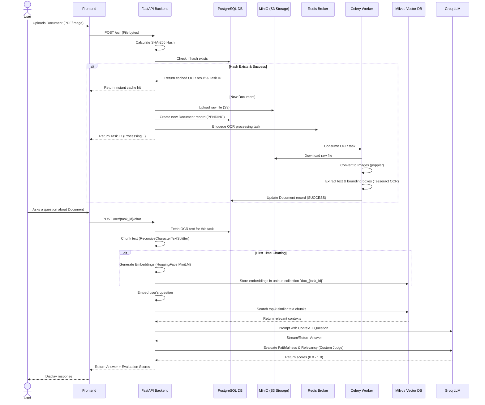

# OCR Pipeline

A scalable, microservices-based Optical Character Recognition (OCR) pipeline.

## Architecture & Workflow


This project is built using a decoupled, service-oriented architecture to ensure scalability and responsiveness. The complete end-to-end workflow is as follows:



### 1. The Upload Phase (Deduplication & Storage)
1. **Fingerprinting**: When a user uploads a file, the FastAPI backend (`api.py`) immediately calculates a cryptographic SHA-256 hash of the file's bytes.
2. **Deduplication Check**: The system queries the **PostgreSQL Database** to see if a document with this exact hash has already been processed.
   - If it has, the system skips all heavy lifting and instantly returns the cached result.
   - If it hasn't, the raw file is saved to **MinIO** (an S3-compatible object storage server).
3. **Queueing**: The backend inserts a `PENDING` record into PostgreSQL and pushes a message to **Redis**, which acts as a message broker for the background workers.

### 2. The OCR Processing Phase (Background Worker)
1. **Task Consumption**: The **Celery Worker** (`worker.py`), which runs independently of the API, picks up the task from Redis.
2. **Extraction**:
   - It downloads the raw file from MinIO.
   - If it's a PDF, `pdf2image` (powered by Poppler) converts the pages into high-resolution images.
   - `pytesseract` (Tesseract OCR) scans the images to extract raw text strings and bounding box coordinates for every word.
3. **Completion**: The worker updates the PostgreSQL record's status to `SUCCESS` and saves the extracted JSON text into the database.

### 3. The Embedding Phase (Vectorization)
When the user asks their first question about the document:
1. **Chunking**: The backend retrieves the raw OCR text from PostgreSQL and splits it into smaller, overlapping paragraphs using Langchain's `RecursiveCharacterTextSplitter`.
2. **Embedding**: It uses a local HuggingFace embedding model (`all-MiniLM-L6-v2`) to convert these text chunks into numerical vectors (arrays of numbers representing semantic meaning).
3. **Vector Storage**: These vectors are saved permanently into the **Milvus Vector Database** inside a dedicated collection named after the document's unique ID.

### 4. The RAG & Chat Phase (Retrieval-Augmented Generation)
1. **Semantic Search**: The user's question is converted into a vector using the same HuggingFace model. The system queries **Milvus** to find the top most mathematically similar text chunks (contexts) from the document.
2. **LLM Generation**: The system sends a prompt to the **Groq API** (`qwen3.6-27b` model) containing both the retrieved context chunks and the user's question, instructing the LLM to answer the question using *only* the provided context.

### 5. The Evaluation Phase (Custom LLM-as-a-Judge)
1. **Judging**: Before returning the final answer to the user, the system makes a secondary, lightning-fast request to the Groq LLM.
2. **Scoring**: It provides the LLM with the context, the question, and the generated answer, asking the LLM to act as an expert judge and rate:
   - **Faithfulness**: Did the answer hallucinate, or did it stick strictly to the context?
   - **Answer Relevancy**: Did the answer actually address the user's question?
3. **Final Output**: The scores are combined with the generated answer and returned to the user's screen.

## Tech Stack

- **Frontend**: [Streamlit](https://streamlit.io/)
- **API / Backend**: [FastAPI](https://fastapi.tiangolo.com/)
- **Task Queue / Asynchronous Processing**: [Celery](https://docs.celeryq.dev/)
- **Message Broker**: [Redis](https://redis.io/)
- **Object Storage**: [MinIO](https://min.io/) (S3-compatible)
- **Containerization**: Docker & Docker Compose
- **Orchestration**: Kubernetes (K8s configuration provided in the `k8s/` directory)

## How to Run the Application

The easiest way to run the entire microservices stack (Frontend, API, Worker, Redis, and MinIO) locally is by using **Docker Compose**. All services are pre-configured to communicate with each other via internal Docker network endpoints.

### Prerequisites
- Install [Docker](https://docs.docker.com/get-docker/) and [Docker Compose](https://docs.docker.com/compose/install/).

### Steps to Run

1. **Clone the repository and navigate to the folder:**
   ```bash
   git clone <your-repository-url>
   cd T_OCR2
   ```

2. **Configure Environment Variables (Optional):**
   The `docker-compose.yml` provides default environment variables that work out of the box. 
   If you wish to change them, copy the `.env.example` file to `.env` and fill in your custom values.
   ```bash
   cp .env.example .env
   ```

3. **Start the Services (Docker Compose):**
   The simplest way to run the stack is directly through Docker Compose. Run the following command in the root directory:
   ```bash
   docker-compose up --build -d
   ```
   *This command will build the frontend, API, and worker images, and spin up all 6 containers in the background.*

4. **Alternative: Smart Startup Script:**
   You can also use the smart startup script to toggle between local Docker deployment and Kubernetes deployment. Ensure you have set your desired environment in your `.env` file:
   - Set `USE_K8S=false` to deploy locally using Docker Compose.
   - Set `USE_K8S=true` to deploy to a Kubernetes cluster using `kubectl`.
   
   Run the following command:
   ```powershell
   .\start.ps1
   ```

4. **Access the Application:**
   Once the containers are running, you can access the different endpoints in your browser:
   - **Streamlit Frontend (UI):** [http://localhost:8501](http://localhost:8501)
   - **FastAPI Documentation (Swagger UI):** [http://localhost:8000/docs](http://localhost:8000/docs)
   - **MinIO Object Storage Console:** [http://localhost:9001](http://localhost:9001) *(Default Login: minioadmin / minioadmin)*

5. **Stop the Services:**
   To stop the application and tear down the containers:
   ```bash
   docker-compose down
   ```

## How the Endpoints Connect

If you decide to run the python applications directly on your host machine without Docker, you will need to start Redis and MinIO manually and define the following environment variables so the Python processes can find them:

- `CELERY_BROKER_URL`: URL to your Redis instance (e.g., `redis://localhost:6379/0`). Used by the **API** and **Worker** to communicate.
- `S3_ENDPOINT_URL`: URL to your MinIO/S3 instance (e.g., `http://localhost:9000`). Used by the **API** and **Worker** to store/retrieve files.
- `AWS_ACCESS_KEY_ID` & `AWS_SECRET_ACCESS_KEY`: Credentials for MinIO.
- `S3_BUCKET_NAME`: Name of the bucket (e.g., `ocr-bucket`).
- `API_URL`: The URL where your FastAPI is running (e.g., `http://localhost:8000/ocr`). Used by the **Frontend** to send requests.
